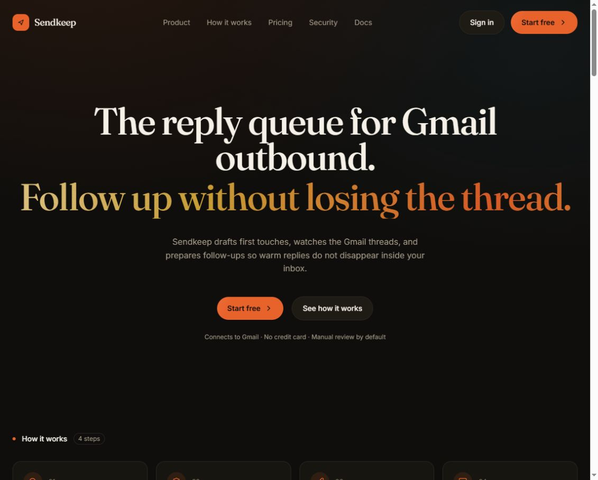
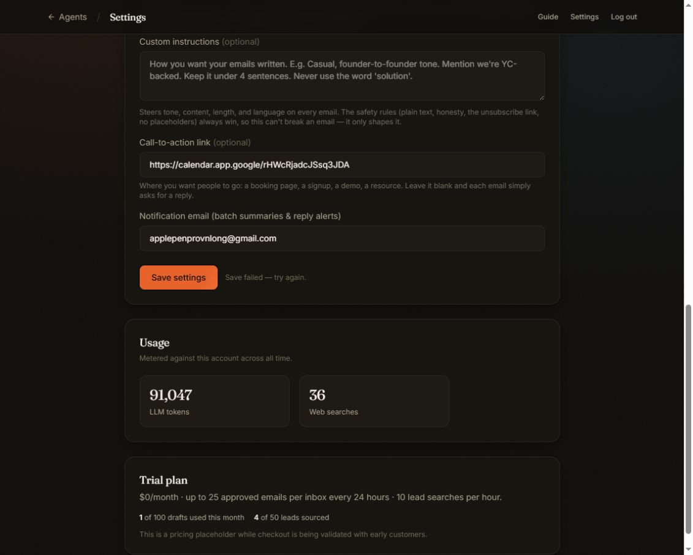
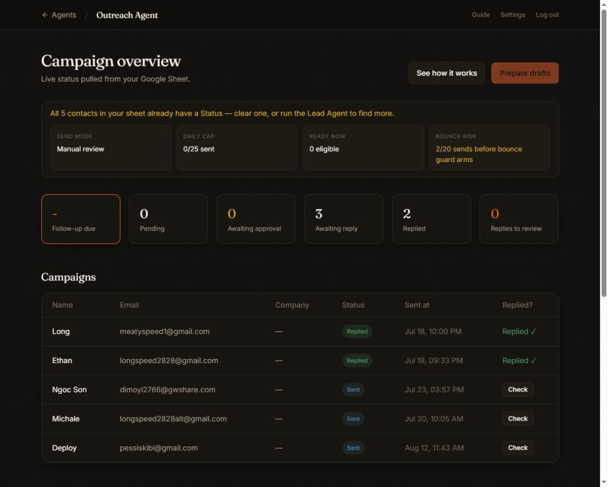
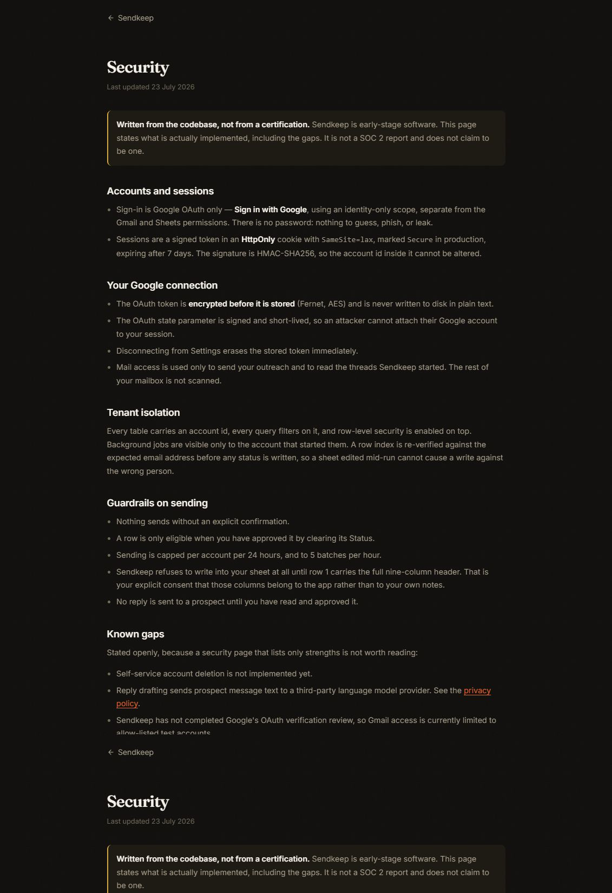
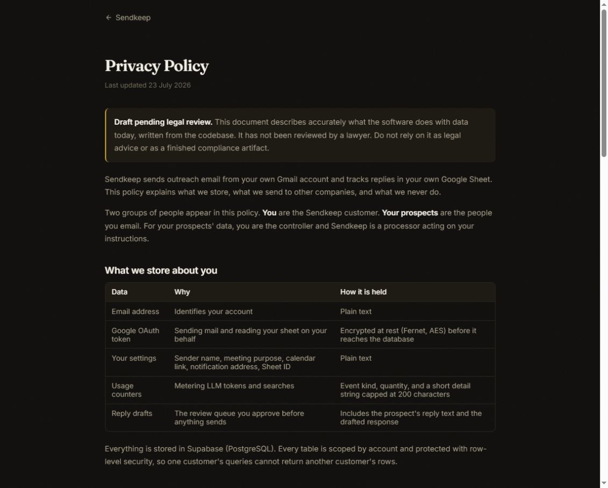
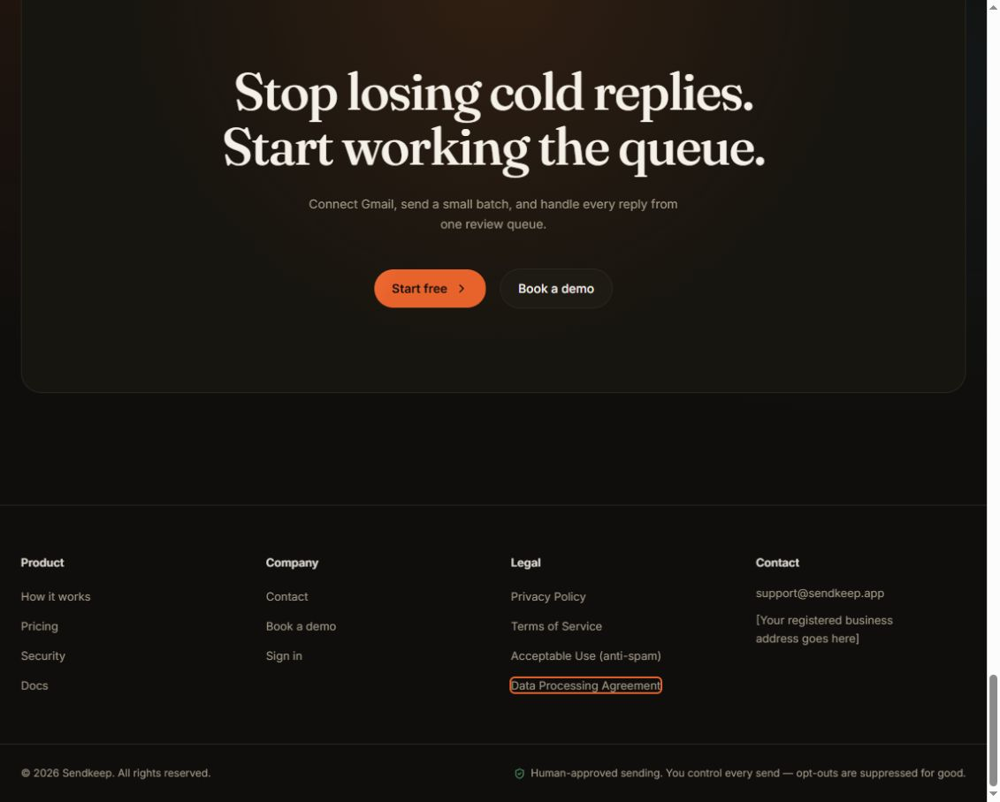

# QA Report: Sendkeep

| Field | Value |
|-------|-------|
| **Date** | 2026-08-17 |
| **URL** | https://8000-e21d5a19-6833-4f5b-bff2-061bf775a7f1.daytonaproxy01.net/ |
| **Branch** | main |
| **Commit** | 173b6d3 (2026-08-15) |
| **Tier** | Exhaustive |
| **Scope** | Full live app, report only; no real emails sent and no records deleted |
| **Duration** | Approximately 18 minutes |
| **Pages visited** | 12 |
| **Screenshots** | 9 |
| **Framework** | FastAPI with React pages and static HTML pages |
| **Status** | Complete with destructive-path exclusions |

## Health Score: 72/100

| Category | Score |
|----------|-------|
| Console / failed requests | 10 |
| Links | 100 |
| Visual | 100 |
| Functional | 45 |
| UX | 85 |
| Performance | 100 |
| Content | 69 |
| Accessibility | 100 |

## Top 3 Things to Fix

1. **ISSUE-002: Settings cannot be saved** — every configuration change fails, blocking onboarding and send-mode configuration.
2. **ISSUE-003: Follow-up status fails to load** — the product's main follow-up workflow is unavailable.
3. **ISSUE-005: Logged-out protected routes render a blank page** — expired or missing sessions strand users without a recovery action.

## Failed-request health

| Error | Observed count in live log | First surface tested |
|-------|----------------------------|----------------------|
| `PUT /api/settings` → 500 | 16 | `/settings` |
| `GET /api/outreach/follow-ups/status` → 500 | 5 | `/outreach` |

The browser-control surface did not expose JavaScript-console messages, so this category uses the live application request log. Both failing requests were reproduced in the UI during this run.

## Summary

| Severity | Count |
|----------|-------|
| Critical | 1 |
| High | 4 |
| Medium | 2 |
| Low | 0 |
| **Total** | **7** |

## Working flows verified

- Public landing page loads and its in-page navigation, yearly-pricing toggle, and all FAQ accordions work.
- `/login` renders correctly and Google sign-in succeeds for the allow-listed account.
- Authenticated `/settings`, `/leads`, `/outreach`, and `/getting-started` pages load.
- Google Sheet picker reads and displays 23 spreadsheets.
- Lead Agent blocks an empty target submission.
- Outreach campaign table and diagnostics load after their initial loading state.
- Per-contact Gmail reply check returned “No reply yet” without an error.
- “Check for replies now” enters and exits its loading state successfully.
- Outreach “See how it works” dialog opens and closes.
- Logout reaches `/login` and the test account can authenticate again.
- Privacy, Security, Terms, Acceptable Use, DPA, and Getting Started pages all render.
- Web server and reply worker remained running throughout the test.
- Measured navigation times were 55 ms (`/`), 82 ms (`/settings`), 179 ms (`/outreach`), 227 ms (`/leads`), and 84 ms (`/privacy`).

## Coverage exclusions

- No real outreach email or reply was sent. Sending affects external recipients and needs an explicitly chosen test address and approval.
- No Google account was disconnected, no lead was discarded, and no data was deleted.
- Draft preparation could not be exercised because all five sheet contacts already had a Status and the control was disabled.
- A live lead search was not run because it consumes metered searches and writes new lead records.
- Mobile/tablet screenshots were not captured because the installed headless runner was blocked by a stale local ACL/daemon lock; the connected browser did not expose viewport emulation.

## Issues

### ISSUE-001: Successful sign-in returns to a logged-out-looking dead end

| Field | Value |
|-------|-------|
| **Severity** | high |
| **Category** | ux |
| **URL** | /signup |

**Description:** Google authentication succeeds, but the callback returns the user to the marketing homepage. The page still shows **Sign in** and **Start free**, exposes no dashboard link, and gives no success message. The authenticated Settings and Guide pages work when opened directly, so this is a post-login navigation/state failure that makes a successful login look unsuccessful.

**Repro Steps:**

1. Navigate to the live homepage.
2. Select **Start free**, or navigate directly to `/signup`.
3. Observe that the final URL is `/` and the page still shows **Sign in** and **Start free**.
4. Navigate directly to `/settings`; observe that the account is actually signed in.

---

### ISSUE-002: Settings cannot be saved

| Field | Value |
|-------|-------|
| **Severity** | critical |
| **Category** | functional |
| **URL** | /settings |

**Description:** Submitting the existing Settings form consistently fails with “Save failed — try again.” This blocks changing the lead sheet, sender identity, send mode, follow-up delay, outreach purpose, call-to-action link, and notification address. The failure reproduced twice without changing any values.

**Repro Steps:**

1. Sign in and navigate to `/settings`.
2. Select **Save settings**.
3. Observe “Save failed — try again.”
4. Repeat the save; the same failure appears.

---

### ISSUE-003: Follow-up status fails to load

| Field | Value |
|-------|-------|
| **Severity** | high |
| **Category** | functional |
| **URL** | /outreach |

**Description:** The core follow-up metric renders as `-` while all other campaign counters resolve normally. The failure reproduced after a fresh page load and an additional five-second wait. Existing campaigns and manual Gmail reply checks still load, but users cannot see or work the promised follow-up-due queue.

**Repro Steps:**

1. Sign in and navigate to `/outreach`.
2. Wait for the campaign diagnostics to finish loading.
3. Observe that **Follow-up due** remains `-` while Pending, Awaiting approval, Awaiting reply, Replied, and Replies to review contain numbers.

---

### ISSUE-004: Security page contradicts auto-send mode

| Field | Value |
|-------|-------|
| **Severity** | medium |
| **Category** | content |
| **URL** | /security |

**Description:** The public Security page states “Nothing sends without an explicit confirmation.” Authenticated Settings offers **Auto-send new drafts**, and the landing page also advertises optional auto mode. Customers cannot tell which sending contract is true.

**Repro Steps:**

1. Navigate to `/security` and read **Guardrails on sending**.
2. Observe “Nothing sends without an explicit confirmation.”
3. Sign in and navigate to `/settings`.
4. Observe the **Auto-send new drafts** option.

---

### ISSUE-005: Logged-out protected routes render a blank page

| Field | Value |
|-------|-------|
| **Severity** | high |
| **Category** | functional |
| **URL** | /settings |

**Description:** Logging out correctly reaches `/login`, but navigating directly to a protected page afterward leaves the browser on `/settings` with a completely blank document. Expected: redirect to `/login` with a clear sign-in action. The blank state reproduced twice.

**Repro Steps:**

1. Sign in and open `/settings`.
2. Select **Log out**.
3. Navigate directly to `/settings`.
4. Observe an empty page with no redirect, message, or recovery action.

---

### ISSUE-006: Public legal documents explicitly say they are unfinished

| Field | Value |
|-------|-------|
| **Severity** | high |
| **Category** | content |
| **URL** | /privacy and /terms |

**Description:** The Privacy Policy says it is pending legal review and must not be treated as a finished compliance document. The Terms say they are not a binding contract and instruct the owner to have a lawyer produce the real version before charging anyone. These warnings are honest, but they make the deployed site unsuitable for paid customer onboarding.

**Repro Steps:**

1. Navigate to `/privacy` and read the warning at the top.
2. Navigate to `/terms` and read its warning.
3. Observe that both customer-facing legal documents disclaim production readiness.

---

### ISSUE-007: Production footer contains an address placeholder

| Field | Value |
|-------|-------|
| **Severity** | medium |
| **Category** | content |
| **URL** | / |

**Description:** The public footer displays `[Your registered business address goes here]`. This is visible placeholder copy on the production URL and undermines trust on a product handling Gmail and prospect data.

**Repro Steps:**

1. Navigate to the live homepage.
2. Move to the footer.
3. Observe the bracketed registered-business-address placeholder.

---
