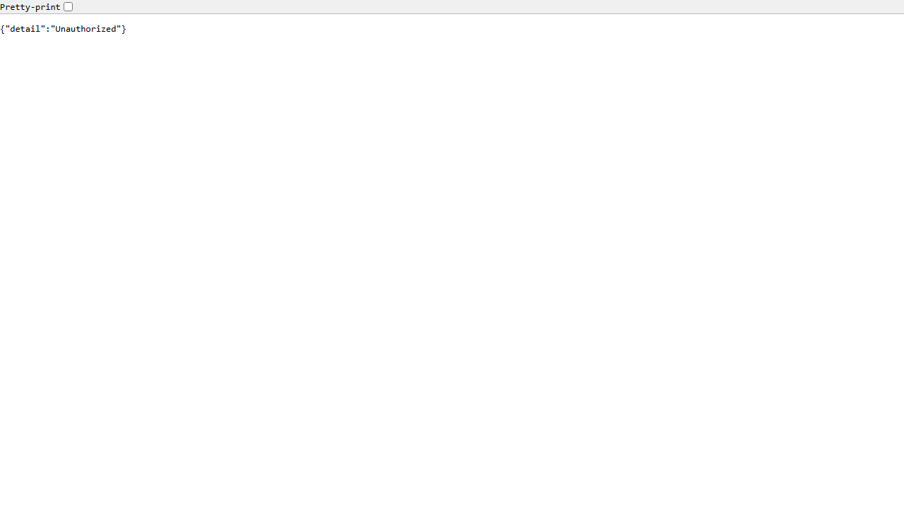
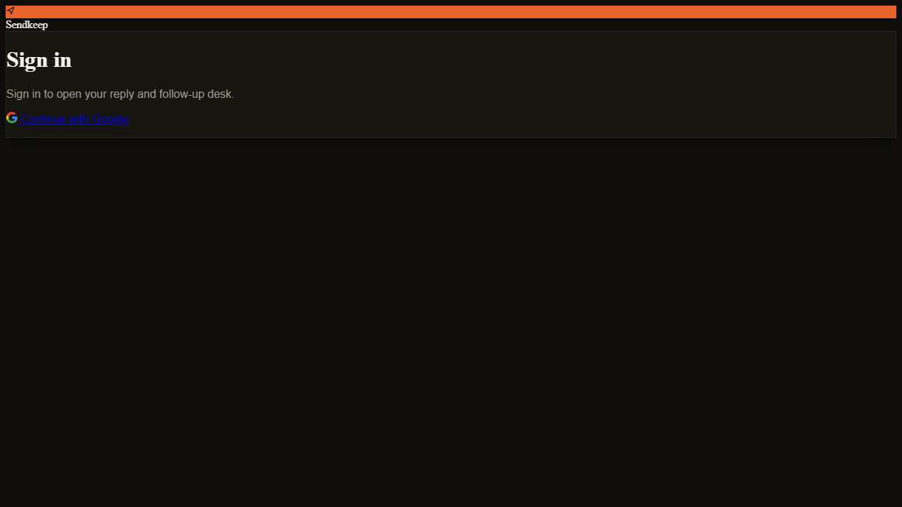
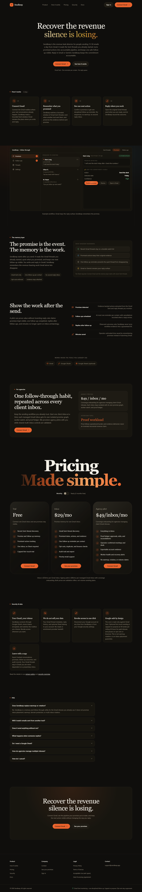
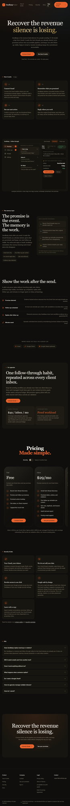

# QA Report: Sendkeep local full app

| Field | Value |
|-------|-------|
| **Date** | 2026-08-24 |
| **URL** | http://localhost:8000 |
| **Branch** | main |
| **Tier** | Standard / full public-flow pass |
| **Scope** | Public landing, login/OAuth entry, docs/legal pages, protected-route redirects, mobile landing, and authenticated outreach traffic observed in the active session |
| **Pages visited** | 17 routes plus 2 direct download endpoints |
| **Screenshots** | 9 current-pass screenshots |
| **Framework** | FastAPI + static HTML + React assets |
| **Auth limitation** | Headless browser could not import the active Chrome cookies; authenticated failures below are corroborated by the live Uvicorn log from the active signed-in session |

## Health Score: 72/100

| Category | Score |
|----------|-------|
| Console | 40 |
| Links | 70 |
| Visual | 84 |
| Functional | 66 |
| UX | 68 |
| Performance | 100 |
| Content | 94 |
| Accessibility | 92 |

## Top 3 Things to Fix

1. **ISSUE-001: Campaign preview returns 500** — The authenticated outreach page requests `/api/outreach/campaigns/preview`, but the endpoint fails when the production schema is missing `reviews.sent_at`.
2. **ISSUE-002: Public guide downloads return 401** — The logged-out Getting Started page links to CSV and Excel templates that cannot be downloaded without a session.
3. **ISSUE-007: Tablet pricing card is clipped** — At 768px, the Agency pilot card is pushed past the viewport and only a sliver is visible.

## Console Health

| Error | Count | First seen |
|-------|-------|------------|
| `Failed to load resource: net::ERR_NETWORK_ACCESS_DENIED` for Google Fonts/Tailwind CDN | Repeated on landing, login, and docs | `/` |
| `401 Unauthorized` from `/api/plan` on public Getting Started | Repeated on page load | `/getting-started` |

## Summary

| Severity | Count |
|----------|-------|
| Critical | 0 |
| High | 1 |
| Medium | 5 |
| Low | 1 |
| **Total** | **7** |

## Issues

### ISSUE-001: Authenticated campaign preview returns 500

| Field | Value |
|-------|-------|
| **Severity** | high |
| **Category** | functional |
| **URL** | http://localhost:8000/outreach?tab=threads |

**Description:** The active signed-in outreach session loaded the page and its queue APIs successfully, but `/api/outreach/campaigns/preview` returned `500 Internal Server Error`. The live server traceback identifies the missing `reviews.sent_at` column in the Supabase project. This means the page can appear loaded while campaign preview/send-limit information is unavailable.

**Repro evidence:**

1. Open the authenticated Outreach desk.
2. Observe the server request to `/api/outreach/campaigns/preview`.
3. **Observe:** `500 Internal Server Error`; boot logs also report `reviews.sent_at is missing`.

**Status:** Confirmed in the live authenticated server log. Not fixed in this report-only pass. The migration must be applied remotely before this is production-safe.

---

### ISSUE-002: Public Getting Started downloads return 401

| Field | Value |
|-------|-------|
| **Severity** | medium |
| **Category** | functional / links |
| **URL** | http://localhost:8000/getting-started |

**Description:** The public guide exposes Excel and CSV download links, but both endpoints return `401 Unauthorized` to a logged-out visitor. A prospect following the documented onboarding flow cannot retrieve the starter template without first creating a session.

**Repro steps:**

1. Open the public guide.
2. Open the CSV link or navigate to `http://localhost:8000/api/lead-sheet-template.csv`.
3. **Observe:** raw `{"detail":"Unauthorized"}` instead of a CSV download.

The Excel endpoint behaves the same way.

---

### ISSUE-003: Login page loses its production styling when CDN assets fail

| Field | Value |
|-------|-------|
| **Severity** | medium |
| **Category** | visual / performance |
| **URL** | http://localhost:8000/login |

**Description:** The login page depends on Tailwind and font assets from external CDNs. When those requests are blocked or unavailable, the page renders with browser-default link and heading styles instead of the intended Sendkeep layout. The core Google link remains usable, but the first trust-critical screen looks unfinished.

**Repro steps:**

1. Open `/login` with external CDN requests unavailable.
2. **Observe:** `ERR_NETWORK_ACCESS_DENIED` for the CDN requests and an unstyled login card.

---

### ISSUE-004: Logged-out tab deep links lose the selected tab after login

| Field | Value |
|-------|-------|
| **Severity** | medium |
| **Category** | functional / UX |
| **URL** | http://localhost:8000/outreach?tab=threads |

**Description:** An unauthenticated direct link to a specific Outreach tab redirects to `/login?next=/outreach`, dropping `?tab=threads`. After Google sign-in, the user is therefore sent to the default Inbox instead of the tab they originally requested.

**Repro steps:**

1. Navigate directly to `/outreach?tab=threads` while logged out.
2. **Observe:** the login URL is `/login?next=/outreach`, with no `tab=threads` query.

---

### ISSUE-005: Marketing workflow buttons are dead controls

| Field | Value |
|-------|-------|
| **Severity** | low |
| **Category** | UX |
| **URL** | http://localhost:8000/ |

**Description:** The landing page presents `Confirm promise`, `Dismiss`, and `Open in Gmail` inside an example workflow card as real buttons. Clicking them produces no state change, navigation, or feedback. This makes a user unsure whether the product is broken or the card is only illustrative.

**Repro steps:**

1. Open the landing page.
2. Click `Confirm promise` in the workflow card.
3. **Observe:** the card remains unchanged and no action occurs.

---

### ISSUE-006: “See your promises” primary CTA routes to signup

| Field | Value |
|-------|-------|
| **Severity** | medium |
| **Category** | UX / content |
| **URL** | http://localhost:8000/ |

**Description:** The pricing card’s `See your promises` CTA points to `/signup`, which starts Google OAuth, while the same label in the footer points to `/outreach?tab=inbox`. The label implies an existing queue view but the primary card sends a new visitor into account creation instead.

**Repro evidence:** The landing page exposes both destinations for the same visible label; the behavior is inconsistent even though both routes are valid.

---

### ISSUE-007: Tablet pricing card is clipped

| Field | Value |
|-------|-------|
| **Severity** | medium |
| **Category** | visual / UX |
| **URL** | http://localhost:8000/ |

**Description:** At a 768px tablet viewport, the three-card pricing row does not reflow. The Agency pilot card begins at approximately x=741 and extends to x=1011, leaving only a narrow visible sliver inside the viewport. The document reports no horizontal overflow because the parent clips the card, so the user cannot reach the full agency offer by scrolling.

**Repro steps:**

1. Open the landing page at `768x1024`.
2. Scroll to Pricing.
3. **Observe:** Trial and Inbox are visible, while Agency pilot is clipped at the right edge.

## Passing Checks

- Landing page returned `200`.
- Login page returned `200`; Google OAuth entry returned a redirect to Google.
- All seven protected Outreach tab URLs redirected to login when logged out.
- Public legal pages (`privacy`, `security`, `terms`, `acceptable-use`, `dpa`) returned `200`.
- Mobile landing at `375x812` had no horizontal overflow (`scrollWidth === clientWidth === 375`).
- Landing pricing toggle changed monthly prices to the expected yearly values (`$290/yr`, `$490/inbox/yr`).
- FAQ expansion worked and exposed the answer content.
- Authenticated queue APIs (`/api/me`, campaigns, replies, commitments, outcomes, evidence, follow-up status) returned `200` in the active session.
- After the timestamp fix, a live reply-check job completed and logged commitment candidates without the previous `tzinfo` exception.
- Landing page load performance measured approximately `326ms` in the headless browser.

## Fixes Applied

None. This was a report-only QA pass.

## Ship Readiness

| Metric | Value |
|--------|-------|
| Health score | 72/100 |
| Issues found | 7 |
| Fixes applied | 0 |
| Deferred | 6 |

**PR Summary:** QA found 7 issues, including 1 high-severity authenticated failure. Do not call the full workflow production-ready until the Supabase migration is applied and campaign preview returns `200`.
